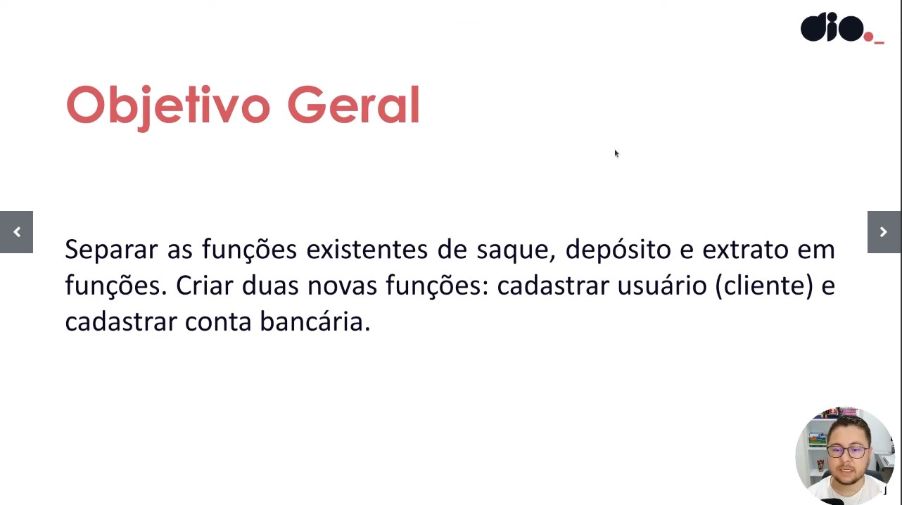

# SISTEMA BANCÁRIO
Objetivo é criar um programa básico em Python para implementar três operações essenciais: depósito, saque e extrato. O sistema será desenvolvido para um banco que busca monetizar suas operações. 
No segundo desafio o objetivo era, pondo em prática a modularização com funções, utilizar tudo que foi aprendido para criar um sistema de banco um pouco mais complexo e completo.

